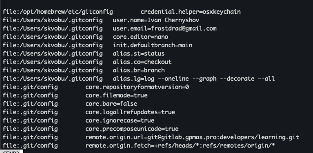
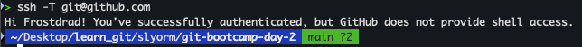
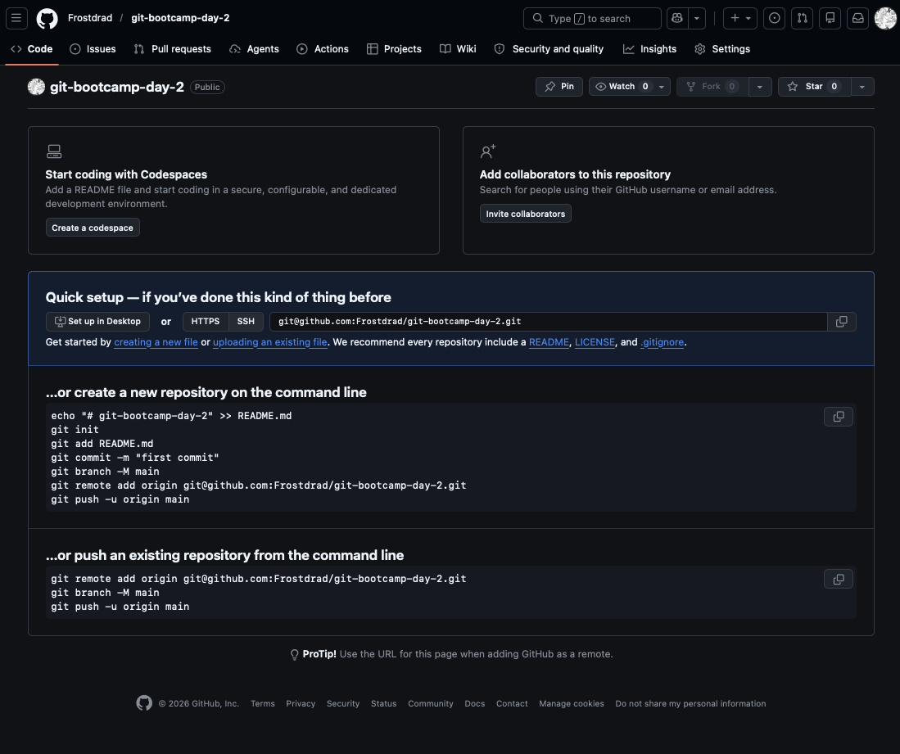
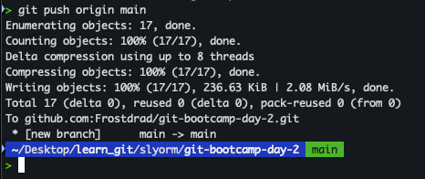
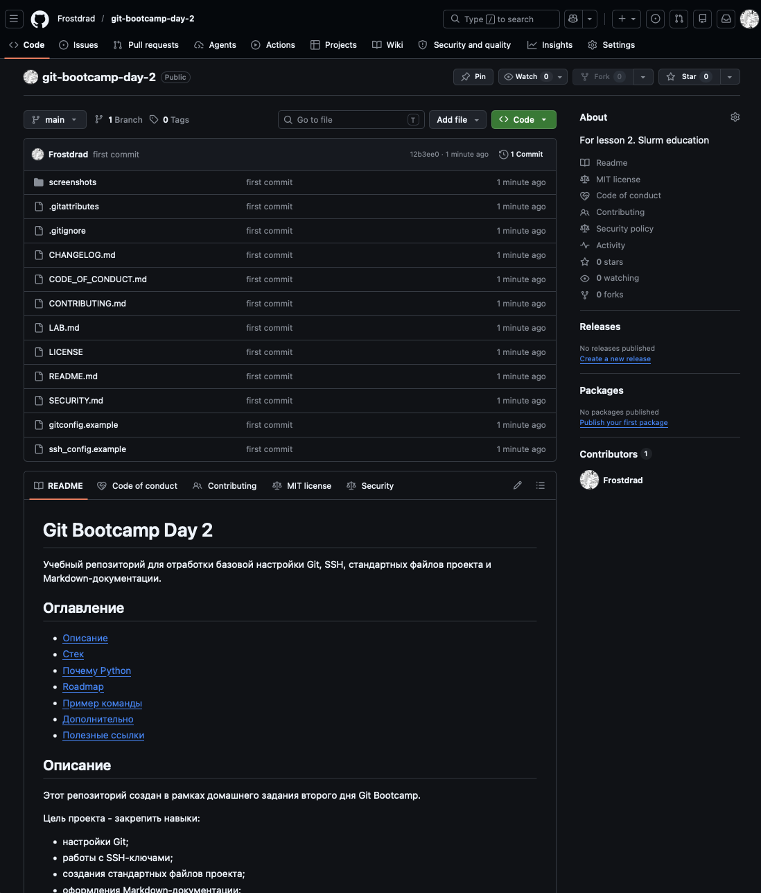

# LAB — день 2

Отчёт о выполнении домашнего задания дня 2 в рамках курса ["Интенсив по погружению в GIT"](https://slurm.io/git-intensive): настройка `gitconfig` и SSH, создание публичного репозитория, наполнение его служебными и стандартными файлами.

## Содержание

- [LAB — день 2](#lab--день-2)
  - [Содержание](#содержание)
  - [Настройка gitconfig](#настройка-gitconfig)
  - [SSH-ключ и подключение к GitHub](#ssh-ключ-и-подключение-к-github)
  - [Создание репозитория](#создание-репозитория)
  - [Служебные файлы](#служебные-файлы)
    - [`.gitignore`](#gitignore)
    - [`.gitattributes`](#gitattributes)
  - [Стандартные файлы и выбор лицензии](#стандартные-файлы-и-выбор-лицензии)
    - [Почему именно эта лицензия](#почему-именно-эта-лицензия)
  - [Markdown](#markdown)
  - [Финальный пуш](#финальный-пуш)

## Настройка gitconfig

В глобальном `gitconfig` я настроил имя пользователя, email, ветку по умолчанию `main`, редактор `nano`, а также несколько алиасов для удобной работы: `st` для `status`, `co` для `checkout`, `br` для `branch` и `lg` для компактного просмотра истории коммитов.

Скриншот вывода `git config --global --list`:



Полный фрагмент моего конфига — в файле [`gitconfig.example`](gitconfig.example).

## SSH-ключ и подключение к GitHub

Точный алгоритм не вспомню, но данный ключ я уже использую для своего гитхаб. Решил оставить его и не создавать новый. Ключ с пассфразой, был добавлен в GitHub, в ~/.ssh/config добавлен отдельый блок для github.com.

Скриншот ответа GitHub на `ssh -T git@github.com`:



Фрагмент моего `~/.ssh/config` — в файле [`ssh_config.example`](ssh_config.example).

## Создание репозитория

На GitHub был создан публичный репозиторий `git-bootcamp-day-2`. README, LICENSE и остальные файлы я подготовил локально и затем отправил в репозиторий через `git push`.

Скриншот свежесозданного репозитория:



## Служебные файлы

### `.gitignore`

Стек: `<Python | MacOS | VSCode>`. Выбрал, потому что на работе делал проекты на Python, который хорошо подходит для рабочих задач по автоматизации, написания скриптов и работы с API..

За основу взял шаблон с `https://www.toptal.com/developers/gitignore/api/python,macos,vscode, так как часто работаю и с ПК на виндовс и с MacOS устройства. Для текущих занятий я думаю этих трех стеков достаточно.

### `.gitattributes`

Минимум — `* text=auto` для нормализации переносов строк между macOS/Linux и Windows. Дополнительные правила:

```text
* text=auto
*.sh text eol=lf
*.png binary
*.jpg binary
*.md text
```

## Стандартные файлы и выбор лицензии

В корне лежат:

- [`README.md`](README.md) — визитка проекта.
- [`CHANGELOG.md`](CHANGELOG.md) — формат Keep a Changelog.
- [`LICENSE`](LICENSE) — выбранная лицензия.
- [`CONTRIBUTING.md`](CONTRIBUTING.md) — как контрибьютить.
- [`CODE_OF_CONDUCT.md`](CODE_OF_CONDUCT.md) — Contributor Covenant.
- [`SECURITY.md`](SECURITY.md) — политика раскрытия уязвимостей.

### Почему именно эта лицензия

Я выбрал MIT License, потому что это простая и понятная инструкция для учебного проекта. Она позволяет использовать/изменять/распространять/применять код в других проектах, при условии сохранения лицензии и уведомлении об авторских правах.

Ссылка на дерево решений: https://choosealicense.com/

## Markdown

В этом отчёте и в `README.md` использованы:

- заголовки `H1`/`H2`/`H3`;
- оглавление в начале со ссылками на якоря;
- блоки кода с подсветкой (`bash`, `text`);
- сворачиваемый блок (см. ниже);
- ссылки на внешние URL.

<details>
<summary>Пример сворачиваемого блока (можно убрать после проверки)</summary>

Перед сдачей я проверил, что репозиторий публичный, все обязательные файлы лежат в корне, скриншоты находятся в каталоге screenshots/ и в конфигурационных файлах нет секретов.

</details>

## Финальный пуш

Терминал с пушем:



Главная страница репозитория после пуша:


